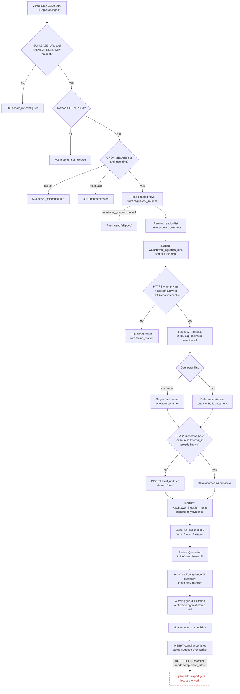
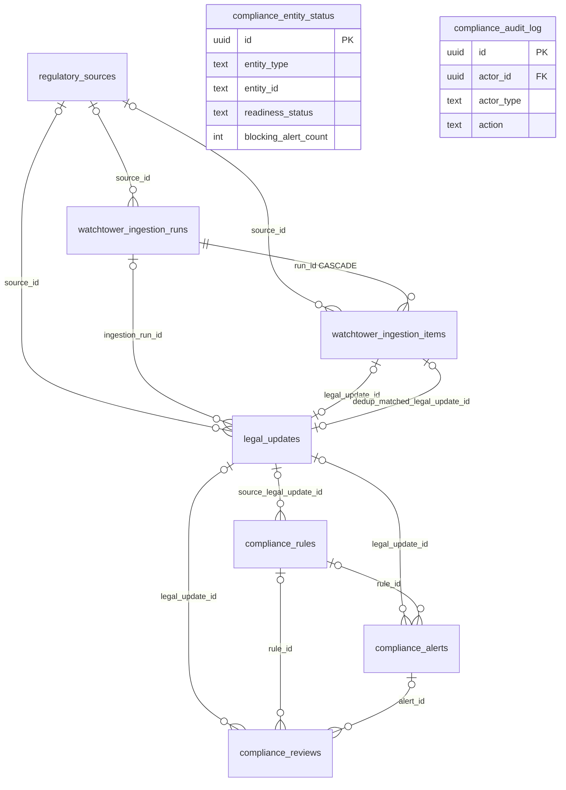
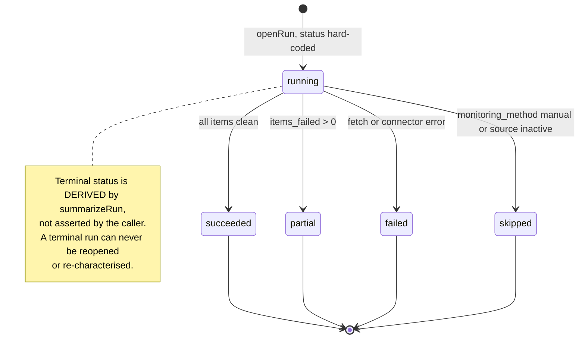
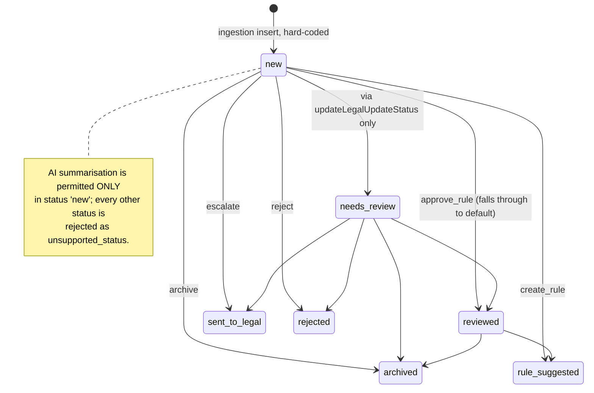
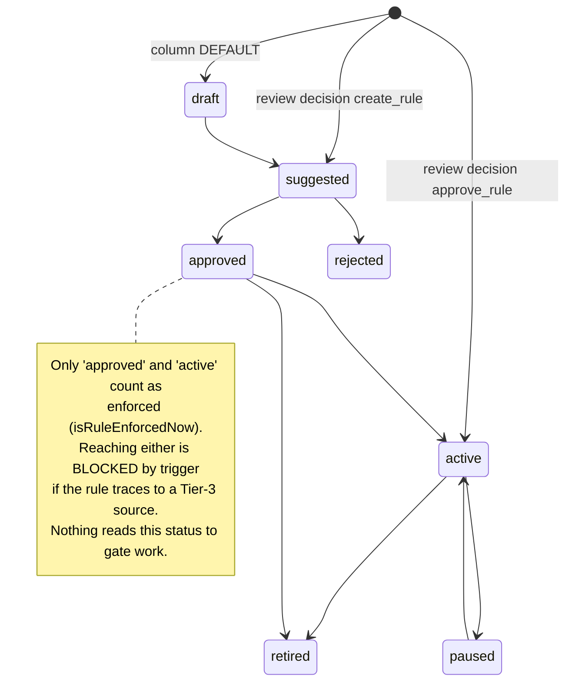

# Compliance Watchtower — Canonical Architecture

The Compliance Watchtower is the part of DDP that watches regulators. An administrator registers a handful of official websites and feeds — Thai FDA, ONCB, EUR-Lex, SÚKL and others — and once a night a scheduled job visits each one, downloads what it finds, and works out whether anything is genuinely new. Anything new becomes a *candidate*: an untriaged item sitting in a queue, with a permanent record of which source it came from, when it was fetched, and a fingerprint of the exact text. An administrator can then ask an AI to write a **draft** summary of a candidate — a draft that is labelled as a draft, is forbidden from approving anything, and has its citations checked against the original text before a human ever sees them. The human reads it, records a decision, and may turn the update into a *compliance rule*. That is where the story stops. Rules are stored, displayed and status-managed, but **nothing in the platform reads a rule to decide whether work may proceed**. The buyer-pack gate — the thing that actually blocks output — computes its blockers from farm documents and risks and never looks at the rules table.

**Status as of 2026-08-06.** Code for retrieval, ingestion, provenance, AI drafting and the review queue exists and is wired together in the repository. Distinguishing what is *built* from what is *observed running in production* (§10):

- **Detection and ingestion — observed running.** 54 ingestion runs, 618 evidence items and 182 candidate updates exist in production, and the nightly sweep's write activity is timestamped 02:01 against a declared 02:00 cron.
- **Human review — observed, barely.** 3 `compliance_reviews` rows and 3 `compliance_rules` rows exist. Against 182 candidates, that is a queue accumulating far faster than it is worked.
- **AI drafting — UNVERIFIABLE from data, by design.** A draft is never persisted (§1), so no row count can show whether the AI path has ever run in production. `ANTHROPIC_API_KEY` is set in Vercel Production, but that the key is present is not evidence the path has executed.
- **Enforcement — BUILT 2026-08-07 (#157, `0a3c81b`).** An unresolved `compliance_alerts` row naming a rule that is blocking now makes `hasBlockingIssues` true, so Print/PDF/Copy are disabled and the pack names the rule. W8 (35 points, `docs/MASTER_PLAN.md:65,298-303`) is **closed**. Rules still do not raise their own alerts — a human links rule to batch (W1).

Governance: GitHub issue **#77** (a P0 gate opened 2026-07-27 saying all other DDP work stops until the source-backed COA Watchtower is complete) was **REVOKED by the owner in writing on 2026-08-07** and closed `NOT_PLANNED`. It was never honoured while it stood, and the revocation says so rather than claiming completion. **No work is gated on it now** — but its non-negotiable rules (§ trust boundary) remain binding on COA work, and its implementation is still unlanded: draft PR **#95** carrying migrations 31–33 is **OPEN and in draft**, alongside PRs **#132** and **#137**.

**Two of nine registered sources fail on every sweep** with HTTP 403 (Thai hosts). Those regulators are not being monitored at all, no item is ever produced for them, and no alert fires. The failures are correctly classified as `failed` rather than as "nothing published" — but the coverage gap is live, not benign (W16, §9).

---

## 1. The governing principle

The intended chain is: **AI detects → AI summarises → human reviews → approved rule → system enforces.**

Two links have been observed operating in production. Two exist as code whose production execution is unverified or unverifiable. The fifth does not exist at all.

| Link | Code exists? | Observed in production? | Evidence |
|---|---|---|---|
| **AI detects** — and "AI" overstates it. Detection is deterministic: a nightly sweep fetches each source, parses feeds into items or fingerprints a page, and compares SHA-256 hashes. No model is involved in finding anything. | Yes (deterministic, not AI) | **Yes** — 54 runs, 618 items, 182 candidates (§10) | `api/cron/ingest.ts:69-136`; `src/lib/watchtowerIngestionService.ts:173-205`; hash at `src/lib/complianceSourceMonitoring.ts:72-76` |
| **AI summarises** — an admin-only endpoint calls a Claude model, blocks unqualified compliance claims outright, and discards citations it cannot find in the stored evidence. | Yes | **Unverifiable** — drafts are never persisted, so no data can answer this either way | `src/lib/serverAiSummary.ts:405`; guard at `src/lib/complianceAiSummarisation.ts:274-281`; citation verification at `:299-306` |
| **Human reviews** — a decision writes a review row, rewrites the legal update's status, optionally creates a rule, and appends an audit-log entry. | Yes | **Yes, 3 times** — against 182 candidates. Note `compliance_audit_log` holds 0 live rows (§10), so the audit half of that path has left no trace | `src/pages/admin/DDPComplianceWatchtower.tsx:1109,1130-1180` |
| **Approved rule** — real as *state* only. A rule can reach status `approved` or `active`, and a trigger is defined to refuse promoting a rule traceable to a Tier-3 source. | Yes (as state) | **Yes** — 3 rules exist | `src/lib/complianceRules.ts:84-86`; `26_WATCHTOWER_SOURCE_GOVERNANCE_HARDENING.sql:219-264` |
| **System enforces** | **NO — NOT BUILT** | n/a | See below |

**On the Tier-3 promotion trigger.** Migration 26 *defines* a trigger that raises when a rule is promoted to `approved`/`active` and the traced source is Tier 3. It does **not** fire when `source_legal_update_id` or the origin tier is NULL (§6) — it is open on NULL. Whether migration 26 is applied in production is UNVERIFIED in this document.

**The enforcement gap, stated precisely.** Two Postgres functions exist specifically to answer "which rules are in force right now" — `compliance_rules_in_force(date)` and `compliance_rules_currently_enforced()`, defined at `41_EFFECTIVE_DATED_RULESETS_HARDENING.sql:226,247` and granted to `authenticated`/`service_role` at `:288-291`. **Verified by grep on 2026-08-06, and re-verified NUL-safely.** `grep -rn "compliance_rules_in_force\|compliance_rules_currently_enforced" src api` returns nothing and exits 1 — but that command alone would **not** have been sufficient evidence. `src/pages/admin/DDPBuyerPreview.tsx`, the file holding the gate itself, contains NUL bytes and is skipped silently by `grep` (§7), so a plain grep asserting "no caller" is partly reading a file it never opened. The check was therefore re-run as `grep -arn` (NUL-safe) across `src` and `api`: still nothing, still exit 1. A direct `grep -an "compliance_rules"` against `DDPBuyerPreview.tsx` also returns nothing, exit 1. **The conclusion holds under the stricter test.** The only files in the repository mentioning either identifier are `41_EFFECTIVE_DATED_RULESETS_HARDENING.sql`, `41_EFFECTIVE_DATED_RULESETS_ROLLBACK.sql`, `41_EFFECTIVE_DATED_RULESETS_VERIFY.sql`, `docs/DISPOSABLE_PG_HARNESS.md`, `docs/MASTER_PLAN.md` and `scripts/disposable-pg/fixtures/41_effective_dated_rulesets.json`. They have **zero application callers**.

The gate that actually decides whether a buyer pack may be emitted is `computeBuyerDisclosureStatus` in `src/pages/admin/DDPBuyerPreview.tsx:125`, feeding `deriveBuyerApprovalGate` (`src/lib/buyerApprovalGate.ts:20`) and `canEmitBuyerPackOutput` (`src/lib/buyerPackOutputGate.ts:19`). Its blocking condition (`DDPBuyerPreview.tsx:184-187`) is: unverified procurement overrides, OR a document requirement in status `rejected`/`expired`, OR an unresolved risk of severity `blocker`. **No compliance rule, alert, or watchtower value enters that computation.**

The one place an approved rule reaches a screen is a read-only text badge on three admin tables, and only when a `compliance_alerts` row already names that rule id (`src/lib/complianceRuleImpact.ts:55-62`). Nothing in the repository evaluates a rule to *produce* such an alert — `insertAlert` (`src/lib/complianceRepository.ts:502`) is a manual repository call. So approving a rule changes what the compliance pages say, not what the platform permits.

---

## 2. End-to-end flow



> The `RULE -.-> ENF` edge is the only dashed one, and `ENF` is the only node carrying the `notbuilt` class. An earlier draft styled it with `linkStyle 20`, which is 0-indexed and actually selected `GUARD --> HUMAN` — it painted the human-review handoff as "not built" and left the genuinely unbuilt enforcement edge looking normal. Do not reintroduce an index-based `linkStyle` here; it silently reindexes whenever an edge is added above it.

**Walkthrough**

1. **Vercel Cron fires a GET at 02:00 UTC daily.** The schedule is declared as `"path": "/api/cron/ingest", "schedule": "0 2 * * *"` in `vercel.json` (crons block, read 2026-08-06), and documented at `docs/runbooks/SCHEDULED_WATCHTOWER_INGESTION.md:3`.
2. **The adapter checks its configuration.** `SUPABASE_URL` and `SUPABASE_SERVICE_ROLE_KEY` are read at `api/cron/ingest.ts:74-75`; missing either returns 503 `server_misconfigured` (`:76-80`). `CRON_SECRET` is read at `:120`.
3. **The core rejects the wrong method, then fails closed on the secret.** Non-GET/POST → 405 (`src/lib/serverScheduledIngestion.ts:95-97`); falsy secret → 503 (`:102-104`); absent or mismatched secret → 401 (`:106-110`), compared in constant time by `secretsMatch` (`:46-53`).
4. **Enabled sources are read.** A read failure returns 503 `sources_unavailable` (`src/lib/serverScheduledIngestion.ts:113-117`). Sources whose `monitoring_method` is `manual` are recorded as an explicit `skipped` run rather than silently omitted (`src/lib/watchtowerIngestionService.ts:124-129`).
5. **A host allowlist is computed per source** — one entry, that source's own hostname (`api/cron/ingest.ts:89-90`; `allowlistFromSources` at `src/lib/serverScheduledIngestion.ts:80-87`). An unparseable URL contributes nothing, so the source is denied.
6. **A run row is opened with status `running`.** Hard-coded at `src/lib/serverIngestionRepository.ts:157`; if the open fails nothing at all is persisted for that source (`src/lib/watchtowerIngestionService.ts:146-154`).
7. **The URL is gated before any socket opens:** HTTPS-only, private/loopback/link-local/metadata hosts rejected, non-standard ports rejected (`src/lib/complianceSourceUrlSafety.ts:156-199`), then exact-match deny-by-default allowlist (`:124-146`).
8. **The fetch runs with hard bounds** — 12,000 ms, 2 MiB, at most 3 redirects, each redirect re-validated including a DNS-resolved address check (`src/lib/serverSourceRetrieval.ts:65-68,439-476`). The body is read streamed with a cap so a lying `Content-Length` cannot exhaust memory (`:264-301,492-510`).
9. **Modality dispatch.** `connectorKindForSource` prefers the stored `monitoringMethod` unless it is `manual`, else falls back to `inferConnectorKind`, which classifies from the URL path alone (`api/cron/ingest.ts:62-67,107-110`; `src/lib/complianceSourceConnectors.ts:173-185`).
10. **RSS/Atom** is parsed by a regex reader into one `ParsedFeedItem` per `<item>`/`<entry>`, and one decision per item (`src/lib/complianceRssConnector.ts:250,358-374,516-518`). **HTML** is deliberately *not* parsed into announcements; the page text is narrowed to a relevance window and hashed as one synthetic item keyed `${source.id}::page` (`src/lib/complianceHtmlWatchConnector.ts:18-24,98-100,233-256`).
11. **Deduplication.** Primary key is the SHA-256 hex of whitespace-normalised content — normalisation at `src/lib/complianceSourceMonitoring.ts:62-64` (`normalizeSourceContent`), digest at `:72-76` (`computeSourceChecksum`, SHA-256 call at `:74`); secondary is `${sourceId}::${externalDocumentId}` (`src/lib/watchtowerIngestionRun.ts:164`). Comparison is against a batch-wide known index plus a per-run `seenThisRun` set (`:159-170`).
12. **A genuinely new item becomes a candidate** — a `legal_updates` row inserted with status hard-coded to `'new'` (`src/lib/serverIngestionRepository.ts:228`; browser path `src/lib/complianceRepository.ts:736`; literal type at `src/lib/watchtowerIngestionRun.ts:68`).
13. **One append-only evidence row per entry** is written to `watchtower_ingestion_items` (`src/lib/watchtowerIngestionService.ts:224-248`). If that insert throws, the item is downgraded so the run cannot report a clean success (`:241-248`).
14. **The run is closed with a *derived* status.** `summarizeRun` computes it from the tallied outcomes — the caller cannot assert `succeeded` (`src/lib/watchtowerIngestionRun.ts:266-272`); the update is scoped `.eq('status','running')` for idempotency (`src/lib/serverIngestionRepository.ts:179-187`).
15. **The candidate appears in the Review Queue tab** of the Watchtower page (`src/pages/admin/DDPComplianceWatchtower.tsx:114`).
16. **AI drafting is optional and gated.** `guardAiSummarisationRequest` allows only a status-`'new'` update with non-empty evidence under 20,000 characters, a configured provider, and no in-flight request (`src/lib/complianceAiSummarisation.ts:95-123`).
17. **The endpoint authenticates, requires `ddp_admin`, validates, then reserves a spend slot** — in that order, for stated reasons (`src/lib/serverAiSummary.ts:395-430`).
18. **Output is guarded twice.** Unqualified compliance/approval wording fails the whole draft (`src/lib/complianceAiSummarisation.ts:274-281`); an ungrounded citation is silently discarded and counted (`:299-306`). Every draft carries `approvesUpdate: false`, `createsRule: false`, `enforces: false`, `certifiesCompliance: false` as literal-false types (`:144-148,325-328`).
19. **A human records a decision**, which writes a review row, rewrites the legal update status, may insert a rule, and appends an audit-log entry (`src/pages/admin/DDPComplianceWatchtower.tsx:1109,1121,1130-1180`).
20. **Rule approval sets `compliance_rules.status` to `active` or `suggested`** (`:1147-1161`). **Step 21 does not exist.** No code path reads `compliance_rules` to gate anything (§1).

> **Steps 1–15 are observed running in production. Steps 16–20 are code paths.** Production holds 54 runs, 618 items and 182 candidates against **3** `compliance_reviews` rows (§10) — so the queue is real and filling, and human triage has happened three times. How many of the 182 remain in status `new` cannot be read with the available credential. Nothing here should be taken to mean the queue is being worked at the rate it fills.

---

## 3. Component map

| Layer | Module | Path | Responsibility |
|---|---|---|---|
| Registry | `complianceSourceRegistry.ts` | `src/lib/complianceSourceRegistry.ts` | Validation gate (`decideRegulatorySourceWrite`) that must return `write` before any DB write; CRUD; derives display status |
| Registry | `complianceSourceGovernance.ts` | `src/lib/complianceSourceGovernance.ts` | Tier / authority / category / monitoring-method / priority vocabularies; Tier-3 authority guard; conservative defaults |
| Registry | `complianceSourceTypes.ts` | `src/lib/complianceSourceTypes.ts` | Dependency-free `sourceType` vocabulary so serverless functions do not import Supabase |
| Registry | `watchtowerStarterSources.ts` | `src/lib/watchtowerStarterSources.ts` | Hard-coded seed list of authority sources with pre-set governance fields |
| Retrieval | `complianceSourceUrlSafety.ts` | `src/lib/complianceSourceUrlSafety.ts` | HTTPS-only, private/metadata host classification, port policy, exact-match deny-by-default allowlist |
| Retrieval | `serverSourceRetrieval.ts` | `src/lib/serverSourceRetrieval.ts` | The only module that opens a real outbound socket; retrieval policy, manual redirect revalidation, DNS-resolved SSRF gate, capped body read, `htmlToText`, `selectRelevantSection` |
| Retrieval | `complianceSourceConnectorRuntime.ts` | `src/lib/complianceSourceConnectorRuntime.ts` | `buildConnectorRunPlan` — the shared pre-fetch gate; performs no I/O |
| Retrieval | `complianceRssConnector.ts` | `src/lib/complianceRssConnector.ts` | RSS/Atom execution and regex parse; one decision per feed entry |
| Retrieval | `complianceHtmlWatchConnector.ts` | `src/lib/complianceHtmlWatchConnector.ts` | Page-change watcher; one synthetic item per source |
| Retrieval | `serverFeedRetrieval.ts` | `src/lib/serverFeedRetrieval.ts` | Operator-triggered retrieval; resolves target from the DB by `sourceId`, never from the caller |
| Ingestion | `watchtowerIngestionRun.ts` | `src/lib/watchtowerIngestionRun.ts` | Pure core: `classifyIngestionItem`, `tallyOutcomes`, `summarizeRun`, `failedRunSummary`, `detectStaleSources` |
| Ingestion | `watchtowerIngestionService.ts` | `src/lib/watchtowerIngestionService.ts` | Orchestrator: open run → fetch → classify → insert candidate + item → close run; all dependencies injected |
| Ingestion | `watchtowerIngestionBrowserDeps.ts` | `src/lib/watchtowerIngestionBrowserDeps.ts` | Browser wiring; the only file reaching the browser Supabase singleton |
| Persistence | `serverIngestionRepository.ts` | `src/lib/serverIngestionRepository.ts` | Server/scheduled repository over an injected **service-role** client (RLS bypassed), bounded to three tables |
| Persistence | `complianceRepository.ts` | `src/lib/complianceRepository.ts` | Browser repository for every watchtower table, under the signed-in admin's session |
| Persistence | `complianceSourceMonitoring.ts` | `src/lib/complianceSourceMonitoring.ts` | Produces the `SourceContentSnapshot` whose `.checksum` is the dedup hash |
| AI | `complianceAiSummarisation.ts` | `src/lib/complianceAiSummarisation.ts` | Eligibility guard, draft model with literal-false capabilities, wording guard, citation verification |
| AI | `serverAiSummary.ts` | `src/lib/serverAiSummary.ts` | Framework-agnostic handler: auth → `ddp_admin` → validate → spend reservation → provider call |
| AI | `serverAiSummaryThrottle.ts` | `src/lib/serverAiSummaryThrottle.ts` | Spend ceiling rules and bucket keys |
| AI | `api/compliance/ai-summary.ts` | `api/compliance/ai-summary.ts` | Vercel adapter; caller-bound anon client for reads, service-role client **only** for the throttle reservation |
| Review UI | `DDPComplianceWatchtower.tsx` | `src/pages/admin/DDPComplianceWatchtower.tsx` | Admin page: Review Queue, Ingestion Runs, rule management; `updateReviewDecision` (:1109), `updateRuleStatus` (:1258) |
| Review UI | `complianceRules.ts` | `src/lib/complianceRules.ts` | Status/severity/entity vocabularies; `isHumanApprovedRuleStatus`; 14 baseline rules, all `suggested` |
| Enforcement | `complianceRuleEnforcement.ts` | `src/lib/complianceRuleEnforcement.ts` | `isRuleEnforcedNow` / `isRuleBlockingNow` / `selectBlockingRuleAlerts`; the fail-closed `RuleEnforcementState` |
| Review UI | `complianceRuleImpact.ts` | `src/lib/complianceRuleImpact.ts` | Read-only join of enforced rules to unresolved alerts; returns a display label only |
| Scheduling | `serverScheduledIngestion.ts` | `src/lib/serverScheduledIngestion.ts` | Method gate, fail-closed secret gate, constant-time compare, per-run allowlist, batch invocation |
| Scheduling | `api/cron/ingest.ts` | `api/cron/ingest.ts` | Vercel Function adapter for the nightly sweep |
| Scheduling | `vercel.json` | `vercel.json` | Cron declaration, CSP/security headers, `git.deploymentEnabled.main: false` |
| Guards | `scripts/api-esm-graph.test.mjs` | `scripts/api-esm-graph.test.mjs` | Walks the transitive runtime import graph of every `api/` entry point for extensionless/unresolvable relative imports and `import.meta` reads |
| Guards | migration 25 | `25_WATCHTOWER_INGESTION_PROVENANCE_HARDENING.sql` | Run/item tables, status algebra CHECKs, dedup indexes, three integrity triggers, deny-by-default grants |
| Guards | migration 26 | `26_WATCHTOWER_SOURCE_GOVERNANCE_HARDENING.sql` | Governance columns, 6 CHECKs, Tier-3 rule-promotion trigger |
| Guards | migration 9 | `9_COMPLIANCE_WATCHTOWER_MVP.sql` | The 7 original tables, CHECK vocabularies, append-only audit trigger, admin-only RLS |

---

## 4. Data model



> **Reading the cardinalities.** Only `watchtower_ingestion_runs ||--o{ watchtower_ingestion_items` has a mandatory parent — `run_id` is NOT NULL (`25_WATCHTOWER_INGESTION_PROVENANCE_HARDENING.sql:185`). Every other parent is drawn `|o` because the child's FK is **nullable with ON DELETE SET NULL**: `legal_updates.source_id` (`9_...:23`), `watchtower_ingestion_runs.source_id` (`25_...:85`), `watchtower_ingestion_items.source_id` (`25_...:186`), `compliance_alerts.rule_id`/`legal_update_id` (`9_...:77-78`), `compliance_rules.source_legal_update_id` (`9_...:66`). Deleting a source therefore orphans its history rather than removing it — deliberate, and load-bearing for provenance.
>
> `watchtower_ingestion_items` carries **two** FKs into `legal_updates`: `legal_update_id` (`25_...:219`) for the row it created, and `dedup_matched_legal_update_id` (`25_...:216`) for the row it was found to duplicate. The second is the column W9 is about; a diagram omitting it cannot be used to reason about that gap.
>
> `compliance_entity_status` and `compliance_audit_log` carry no foreign keys into the rest of the diagram — `entity_id` is free TEXT (`9_COMPLIANCE_WATCHTOWER_MVP.sql:76,91`) and `actor_id` points at `auth.users`. They are shown with attribute blocks for that reason; the connected tables are shown as a relationship map only.

### regulatory_sources — `9_COMPLIANCE_WATCHTOWER_MVP.sql:9-19`
**Purpose:** the registry of monitored regulators; the *only* legal fetch targets.
**Key columns:** `name`, `jurisdiction`, `source_type`, `url`, `is_active`, `last_checked_at`; migration 26 adds `tier`, `authority_type`, `category`, `monitoring_method`, `priority` (`26_...:73-78`), backfilled to the least-authority shape (`:88-100`) then made NOT NULL with defaults (`:109-121`).
**CHECKs:** `tier IN (1,2,3)`; closed vocabularies for `authority_type`, `category`, `monitoring_method`; `priority BETWEEN 1 AND 100`; `tier <> 1 OR authority_type NOT IN ('news_media','aggregator')` (`26_...:125-161`).
**RLS:** admin-all via `is_ddp_admin()` (`9_...:191`). **Append-only:** none.
**Reads/writes:** admin UI via `complianceSourceRegistry.ts`; read by the cron sweep and `serverFeedRetrieval.ts:338-349`.

### legal_updates — `9_COMPLIANCE_WATCHTOWER_MVP.sql:21-38`
**Purpose:** a regulatory item, whether ingested or pasted. This is the candidate queue.
**Key columns:** `title`, `jurisdiction`, `source_name`, `source_url`, `raw_text`, `ai_risk_level`, `status`, `reviewer_notes`; migration 25 adds nullable provenance `content_hash`, `canonical_url`, `external_document_id`, `source_tier`, `ingestion_run_id`, `ingestion_item_key` (`25_...:261-301`).
**CHECKs:** `status IN ('new','needs_review','reviewed','rule_suggested','sent_to_legal','archived','rejected')` — **verified 2026-08-06 at `9_...:34`**, mirrored exactly in `src/lib/complianceRules.ts:27-35`; `ai_risk_level` info..critical, NULL-tolerant; format/length CHECKs on the provenance columns (`25_...:271-293`).
**Indexes:** partial UNIQUE on `content_hash` where non-null (`25_...:326-328`); UNIQUE `(source_id, external_document_id)`; `canonical_url` deliberately non-unique (`25_...:332-341`).
**RLS:** admin-all (`9_...:195`). **Append-only:** none.
**Reads/writes:** written by both ingestion repositories with status hard-coded `'new'`; read by the Review Queue and by the AI endpoint under the caller's own RLS (`api/compliance/ai-summary.ts` `getLegalUpdate`).

### watchtower_ingestion_runs — `25_...:82-171`
**Purpose:** one row per check of one source. The durable evidence that monitoring happened.
**Key columns:** `source_id`, source name/url/tier snapshots, `connector_kind`, `trigger_type`, `actor_type`, `actor_id`, `status`, `failure_reason`, `error_detail`, five item counters, `started_at`, `finished_at`.
**CHECKs:** closed vocabularies for connector kind / trigger / actor type / status / failure reason; `error_detail` ≤ 2000 chars; non-negative counters; and a **status algebra** — `running` has no `finished_at`/reason; `succeeded` requires `finished_at`, zero failures, no reason; `partial`/`failed`/`skipped` require both `finished_at` and a reason; `partial` requires `items_failed > 0`; counters must sum to `items_seen` (`25_...:147-170`).
**RLS:** admin SELECT/INSERT/UPDATE, no DELETE policy (`25_...:512-522`). **Append-oriented, not append-only:** DELETE always raises and terminal status can never change (`25_...:411-427`), but one completion UPDATE is permitted; `DELETE, TRUNCATE` revoked even from `service_role` (`25_...:499`).
**Reads/writes:** written by `serverIngestionRepository.ts` / `complianceRepository.ts`; read by the Ingestion Runs tab.

### watchtower_ingestion_items — `25_...:182-250`
**Purpose:** per-entry outcome inside a run — what was seen and what was decided about it.
**Key columns:** `run_id` (NOT NULL, ON DELETE CASCADE), `item_key`, `external_document_id`, `canonical_url`, `title`, `content_hash`, `dedup_decision`, `dedup_matched_legal_update_id`, `legal_update_id`, `failure_reason`.
**CHECKs:** `item_key` 1..512; `content_hash ~ '^[0-9a-f]{64}$'`; `dedup_decision` in 7 values; `legal_update_id` only when the decision is `new`; hash required unless `invalid`/`error`; failure reason required when `invalid`/`error`; UNIQUE `(run_id, item_key)` (`25_...:236-250`).
**RLS:** admin SELECT/INSERT only (`25_...:524-530`). **Append-only:** yes — trigger `watchtower_ingestion_items_no_update_delete` raises on any UPDATE or DELETE (`25_...:384-398`), grants are SELECT+INSERT only (`:496,504`), and `DELETE, TRUNCATE` are revoked from `service_role` (`:499`). Insert is refused if the parent run is not `running` (`:441-471`).

### compliance_rules — `9_...:56-71`
**Purpose:** the rule catalogue — what the platform *would* enforce.
**Key columns:** `rule_code` UNIQUE, `entity_type`, `severity`, `status`, `is_blocking`, `source_legal_update_id`, `approved_by`.
**CHECKs:** `entity_type` (8 values), `severity` (5), `status IN ('draft','suggested','approved','active','paused','retired','rejected')` DEFAULT `'draft'` (`9_...:65`, verified 2026-08-06; mirrored `src/lib/complianceRules.ts:50-58`).
**Trigger:** `compliance_rules_tier3_authority_guard` BEFORE INSERT OR UPDATE OF status, source_legal_update_id — raises if status is `approved`/`active` and the traced source is Tier 3 (`26_...:219-264`).
**RLS:** admin-all (`9_...:203`). **Append-only:** none.
**Reads/writes:** written by the review UI; read by `complianceRuleImpact.ts` for a display badge. **Not read by any gate.**

### compliance_reviews — `9_...:40-54`
**Purpose:** the human review record.
**Key columns:** `legal_update_id`, `alert_id`, `rule_id`, `review_type`, `status`, `reviewed_by`, notes. FKs to alerts/rules added in a guarded DO block after both tables exist (`9_...:131-154`).
**CHECKs:** `review_type` (5 values), `status IN ('pending','in_review','reviewed','sent_to_legal','rejected','archived')` (`9_...:47`).
**RLS:** admin-all (`9_...:199`). **Append-only:** none — freely updatable and deletable by admins.

### compliance_alerts — `9_...:73-86`
**Purpose:** a per-entity finding raised against a rule.
**Key columns:** `rule_id`, `legal_update_id`, `entity_type`, `entity_id` (free TEXT, **no FK**), `severity`, `status`. No `updated_at`.
**CHECKs:** `entity_type` (8), `severity` (5), `status IN ('open','in_review','blocked','resolved','dismissed')` (`9_...:82`).
**RLS:** admin-all (`9_...:207`). **Append-only:** none.
**Writers:** `insertAlert` (`src/lib/complianceRepository.ts:502`) only — no rule-evaluation producer exists.

### compliance_entity_status — `9_...:88-100`
**Purpose:** the current readiness verdict per entity; UNIQUE `(entity_type, entity_id)` makes it an upsert target.
**Key columns:** `readiness_status` (8 values incl. `blocked`, `human_approved`), `risk_level`, `blocking_alert_count` (≥ 0), `missing_requirements` JSONB default `'[]'`.
**RLS:** admin-all (`9_...:211`). **Append-only:** none. Written by `upsertEntityStatus` (`src/lib/complianceRepository.ts:568`); **not shown to be read by any gate** — UNVERIFIED beyond the repository layer.

### compliance_audit_log — `9_...:102-129`
**Purpose:** the append-only workflow audit trail.
**Key columns:** `actor_id` (FK → `auth.users` ON DELETE SET NULL), `actor_type`, `action` (closed list of 15), `entity_type`, `entity_id`, details.
**RLS:** admin **INSERT and SELECT only** — no UPDATE or DELETE policy exists at all (`9_...:214-220`).
**Append-only:** yes, by two mechanisms — row trigger `compliance_audit_log_no_update_delete` (`9_...:177-180`) and statement trigger `compliance_audit_log_no_truncate` (`11_COMPLIANCE_AUDIT_LOG_TRUNCATE_HARDENING.sql:37-42`), both which migration 15 *intends* to promote to ENABLE ALWAYS (`15_EXISTING_TABLE_AND_AUDIT_LOG_HARDENING.sql:61-67`), plus `REVOKE UPDATE, DELETE ... FROM anon, authenticated` (`15_...:59`). **MEASURED 2026-08-07: migration 15 is only HALF applied in production** — the REVOKE took (neither `anon` nor `authenticated` holds UPDATE or DELETE) but both triggers report `pg_trigger.tgenabled = 'O'`, the default origin/local mode, not `'A'`. See W18.
**Attribution weakness:** see §6 and W3 in §9.

---

## 5. State machines

### (a) Ingestion run — full vocabulary from the SQL CHECK at `25_WATCHTOWER_INGESTION_PROVENANCE_HARDENING.sql:104-105`

> **Citation split, because the two sources disagree in scope.** The TypeScript union `IngestionRunStatus` (`src/lib/watchtowerIngestionRun.ts:204`) is `'succeeded' | 'partial' | 'failed' | 'skipped'` — four values, **no `running`**, because it types only *terminal* statuses. `running` exists solely as the column DEFAULT and CHECK (`25_...:104-105`) and as the hard-coded insert at `src/lib/serverIngestionRepository.ts:157`. A reader who follows the union citation looking for the start state will not find it.



Per-item decisions are a separate vocabulary: `new`, `unchanged`, `duplicate_content_hash`, `duplicate_external_id`, `duplicate_canonical_url`, `invalid`, `error` (`src/lib/watchtowerIngestionRun.ts:24-31`; CHECK at `25_...:205-213`). `duplicate_canonical_url` is never produced by `classifyIngestionItem` (§9, W6).

### (b) legal_update / candidate — CHECK at `9_...:34`, verified 2026-08-06



Transitions are written by `updateReviewDecision` (`src/pages/admin/DDPComplianceWatchtower.tsx:1121,1130-1139`). The AI restriction is at `src/lib/complianceAiSummarisation.ts:110-112`.

**`approve_rule` did not advance the update to `rule_suggested` — verified 2026-08-06, FIXED 2026-08-07 (W17).** The decision→status ternary at `:1130-1138` names `send_to_legal`, `reject`, `archive` and `create_rule`; `approve_rule` is absent and falls through to the `'reviewed'` default. Yet the same handler inserts the rule with `status: decision === 'approve_rule' ? 'active' : 'suggested'` (`:1157`) and stamps `approvedBy`/`approvedAt` (`:1159-1160`). **So the strongest available decision produces an `active` rule while leaving the legal update reading merely `reviewed` — a weaker status than the one `create_rule` produces.** Whether that is intended is unresolved; it is logged as W17 in §9.

`needs_review` is drawn as reachable only via `updateLegalUpdateStatus` (`src/lib/complianceRepository.ts:242`), which takes any CHECK-valid value: **no review decision produces it.** The diagram is not an exhaustive proof that no other pair is writable. **UNVERIFIED:** whether any code enforces transition legality beyond the CHECK on the value itself.

### (c) compliance_rule — CHECK at `9_...:65`, verified 2026-08-06



`isHumanApprovedRuleStatus` at `src/lib/complianceRules.ts`, and the enforcement predicate `isRuleEnforcedNow` at `src/lib/complianceRuleEnforcement.ts`. **These were one overloaded function until 2026-08-07**: it answered both "has a human blessed this?" (approval stamping) and "does this gate work now?" (the gate, rule impact, alert derivation), so a caller could not tell which it had asked. Split per the reasoning `41_EFFECTIVE_DATED_RULESETS_HARDENING.sql` had already applied on the database side. **The divergence is CLOSED.** The owner decided on 2026-08-07 that `approved` means *switched on*, not a staging state ahead of activation. That resolved it in the application's favour, so **migration 61 widened the SQL** — `compliance_rules_currently_enforced()` now accepts `('approved','active')`, and `compliance_rules_in_force()` accepts `('approved','active','paused','retired')` — rather than narrowing the application, which would have silently stopped a rule that blocks a pack today from blocking it tomorrow. The two sides are now a contract, pinned at both ends: the parity test in `complianceRuleEnforcement.test.ts` and section B of `61_RULE_ENFORCEMENT_STATUS_PARITY_VERIFY.sql`. Insert statuses at `src/pages/admin/DDPComplianceWatchtower.tsx:1157`. Tier-3 promotion guard at `26_...:230-257`. The 14 baseline rules all ship as `suggested` (`src/lib/complianceRules.ts:102` onward), so out of the box no baseline rule is enforced. Transitions other than the insert paths are driven by `updateRuleStatus` (`DDPComplianceWatchtower.tsx:1258`); the specific allowed pairs are **UNVERIFIED** — the database CHECK constrains values, not transitions.

---

## 6. Trust boundaries and invariants

> **Scope of "closed" in this table.** It means the invariant is enforced by code or DDL **present in the repository**. For every database-level row it additionally assumes the named migration is *applied in production* — which this document verifies for exactly one case: migration 27, which is **not** applied (§10, W3). The production state of migrations 9, 11, 15, 25 and 26 is not established here. The one production-side corroboration available (`ddp_ro` denied by `is_ddp_admin`, §10) covers RLS only.

| Invariant | Enforced by | Evidence | Fails |
|---|---|---|---|
| The fetch target is never caller-supplied — it is read from the DB by `sourceId` | `serverFeedRetrieval` source resolution; cron reads the source row | `src/lib/serverFeedRetrieval.ts:338-349`; `api/cron/ingest.ts:89-90` | **closed** (404 `unknown_source`) |
| Only HTTPS; private, loopback, link-local and metadata hosts rejected; non-standard ports rejected | `validateConnectorUrlSafety` / `isPrivateOrUnsafeHost` | `src/lib/complianceSourceUrlSafety.ts:84-114,156-199` | **closed** |
| Host allowlist is exact-match and deny-by-default; an empty list allows nothing | `validateConnectorAllowlist` | `src/lib/complianceSourceUrlSafety.ts:124-146` | **closed** |
| Every redirect hop is re-validated, including a DNS-resolved address check; >3 hops rejected | `retrieveOfficialSource` manual redirect loop + `validateResolvedAddresses` | `src/lib/serverSourceRetrieval.ts:226-250,439-476` | **closed** |
| Response body is bounded — declared oversize rejected before reading, streamed read aborts at the cap | `readCapped` | `src/lib/serverSourceRetrieval.ts:264-301,492-510` | **closed** |
| Connectors never open a socket themselves and can never persist, create a rule, or call AI | Literal-`false` capability fields on `RssConnectorResult` / `ConnectorRunPlan` | `src/lib/complianceRssConnector.ts:151-156,519-523`; `src/lib/complianceSourceConnectorRuntime.ts:94-98` | **closed** (type-level) |
| No non-admin role can read or write any of the 9 tables | RLS policies calling `public.is_ddp_admin()` | `9_...:182-220`; `25_...:509-530`; function at `AUTH_RLS_SCHEMA.sql:101-117` | **closed** |
| The scheduled path bypasses RLS and is bounded only by convention | Service-role client injected into `serverIngestionRepository` | `api/cron/ingest.ts:82-85`; `src/lib/serverIngestionRepository.ts:24-33` | **open** — see W2 |
| The AI endpoint uses a caller-bound anon client for every read; service-role is used **only** for the throttle reservation | `buildDeps` in the adapter | `api/compliance/ai-summary.ts:61-90,105-145` | **closed** |
| AI runs only for an admin, only on a status-`new` update, only with evidence ≤ 20,000 chars, and only when a provider is configured | `serverAiSummary.ts` gate order + `guardAiSummarisationRequest` | `src/lib/serverAiSummary.ts:405`; `src/lib/complianceAiSummarisation.ts:95-123,29` | **closed** |
| Spend ceiling: 10/hour and 40/day per admin, 200/day globally, reserved atomically under an advisory lock | `AI_SUMMARY_THROTTLE_RULES` + `reserve_public_intake_slot` RPC | `src/lib/serverAiSummaryThrottle.ts:59-62,83`; `api/compliance/ai-summary.ts:165-180` | **closed** — a ledger error throws rather than allowing (`:180`) |
| An AI draft can never approve, create a rule, enforce, or certify | Literal-`false` fields on `AiSummaryRequest` and `AiDraftSummary` | `src/lib/complianceAiSummarisation.ts:39-42,144-148,325-328` | **closed** (type-level) |
| An unqualified compliance/approval claim in AI prose blocks the whole draft | `guardAiDraftedFields` | `src/lib/complianceAiSummarisation.ts:274-281` | **closed** |
| A citation the model cannot ground in the stored evidence is discarded and counted | `verifySourceReferences`, run only where authoritative evidence lives | `src/lib/complianceAiSummarisation.ts:288-306` | **closed** |
| An unset `CRON_SECRET` disables the nightly route rather than opening it | Falsy check before any comparison | `src/lib/serverScheduledIngestion.ts:102-104` (quoted below) | **closed** |
| A missing and a wrong cron secret are indistinguishable, and comparison is constant-time | Single 401 branch; `secretsMatch` XOR loop | `src/lib/serverScheduledIngestion.ts:46-53,106-110` | **closed** |
| `compliance_audit_log` rows can never be updated, deleted or truncated by a client role | Row trigger + TRUNCATE trigger, plus revoked grants and no such RLS policy | `9_...:166-180`; `11_...:37-42`; `15_...:59-67` | **closed for client roles**, but NOT `ENABLE ALWAYS` in production (`tgenabled='O'`, measured 2026-08-07) — so the triggers do not fire under `session_replication_role='replica'`. See W18 |
| Ingestion items are append-only and cannot be attached to a closed run | `prevent_watchtower_ingestion_item_mutation` + `guard_watchtower_ingestion_item_insert` | `25_...:384-398,441-471` | **closed** |
| A run that did not complete cleanly must name a reason and a finish time | Table CHECKs `..._running_shape` / `_succeeded_shape` / `_terminal_reason` / `_partial_shape` | `25_...:147-163` | **closed** |
| The same normalised content can only ever become one `legal_update` | Partial UNIQUE index `uniq_legal_updates_content_hash` | `25_...:326-328` | **closed** |
| A rule traceable to a Tier-3 source cannot reach `approved`/`active` | `guard_rule_source_authority()` trigger | `26_...:219-264` | **open on NULL** — a NULL `source_legal_update_id` or NULL origin tier passes through (`26_...:237-249`) |
| Audit attribution is authoritative | *Claimed* by a comment at `src/lib/complianceRepository.ts:650-656`; the trigger lives in `27_COMPLIANCE_AUDIT_LOG_ACTOR_AUTHORITATIVE_HARDENING.sql:39-65` | **Migration 27 is NOT applied in production** — `fn_compliance_audit_log_set_actor` is absent from `pg_proc`, measured 2026-08-06 (§10) | **OPEN** — `compliance_audit_log.actor_id` is whatever the browser sends, in an append-only table where a forged entry is permanent. The source comment claims a protection that does not exist. See W3 |

**The `CRON_SECRET` gate, quoted verbatim from `src/lib/serverScheduledIngestion.ts:99-110`:**

```ts
  // FAIL CLOSED ON AN UNSET SECRET. If CRON_SECRET is missing this route is an
  // unauthenticated trigger for an outbound fetch sweep, so a missing secret
  // must disable the route, never open it.
  if (!deps.cronSecret) {
    return { status: 503, body: { ok: false, error: 'server_misconfigured' } }
  }
  const provided = presentedSecret(headers)
  if (!provided || !secretsMatch(deps.cronSecret, provided)) {
    // Deliberately indistinguishable from "route does not exist" in wording,
    // and identical for a missing and a wrong secret.
    return { status: 401, body: { ok: false, error: 'unauthenticated' } }
  }
```

---

## 7. Failure modes

| Failure | Behaviour | Where recorded | Evidence |
|---|---|---|---|
| Extensionless relative import ships into `api/` | Under unbundled Vercel Node ESM the function dies with `ERR_MODULE_NOT_FOUND` on its **first live request**, while tsc, vite, vitest, build and deploy all go green. Caught by a graph walk over every `api/` entry point. | Test failure. Runs under `npm test` — locally via `ci:verify` (`package.json:19`) and in CI at `.github/workflows/security-ci.yml:101`. **`ci:verify` itself appears in no workflow** (verified 2026-08-06); whether that job is a *required* status check is branch-protection state, not repo state, so "blocks a merge" is unverified here. | `scripts/api-esm-graph.test.mjs:1-19,111-126`; wired via `vite.config.ts:34` and `package.json:12,19` |
| A module reachable from `api/` reads `import.meta.env` | Undefined under Node ESM — throws at module load, killing the endpoint. The browser Supabase singleton (`src/lib/supabase.ts:13-14`) is exactly this hazard, which is why `watchtowerIngestionService.ts` imports the browser repository **type-only** (`:16-21`). | Test failure in `ci:verify` | `scripts/api-esm-graph.test.mjs:128-153` |
| `tsc --noEmit` used as the type check | Vacuous in this project layout — the real check is `tsc -b`, which is what `build` and `ci:verify` run. A `--noEmit` pass is not evidence the project type-checks. | — | `package.json:9,19` |
| Env var rotated without a redeploy | Values bind to a deployment **at build time**, so the running deployment keeps the old value. Rotation is `vercel env rm` + `vercel env add` + `vercel redeploy`. `vercel.json` additionally sets `git.deploymentEnabled.main: false`, so a push to main does not by itself produce a new production build. | Runbook | `docs/runbooks/SCHEDULED_WATCHTOWER_INGESTION.md` (rotation note); `vercel.json` git block |
| A green deploy taken as evidence an endpoint works | It is not. The only evidence is a real HTTP request. The runbook's own verification is two `curl` calls — an unauthenticated one that must return 401, and an authenticated POST that must return a counts body. | Runbook | `docs/runbooks/SCHEDULED_WATCHTOWER_INGESTION.md` "Verifying it works" |
| `CRON_SECRET` unset or removed | Every invocation returns 503 `server_misconfigured`; the nightly sweep silently never runs while the UI looks entirely healthy. | Nowhere — silent | `src/lib/serverScheduledIngestion.ts:102-104`; runbook: "The failure is silent from a user's point of view" |
| Whole-page fingerprint churn | The HTML watcher hashes a 12-line window around the single highest-scoring line, not the whole page — deliberately, to avoid nav/timestamp churn. The accepted cost is that a change far from any watch term is not noticed. If no watch term matches at all it silently falls back to the opening of the document with `matched:false` and fingerprints that. | Item row in `watchtower_ingestion_items` | `src/lib/serverSourceRetrieval.ts:344-375`; `src/lib/complianceHtmlWatchConnector.ts:36-38,226-228` |
| HTTP 403 from a Thai host | Recorded as an ordinary `failed` run with reason `fetch_failed` — never mistaken for "nothing was published". Two failed runs per sweep are the documented expected steady state. | Run row, status `failed` | `src/lib/complianceHtmlWatchConnector.ts:197-203`; runbook "Expected steady state" |
| Source unreachable / timeout / off-allowlist / malformed feed | Run closed `failed` with a mapped `failure_reason` and zero counters. The status algebra CHECK makes "success with zero changes" unreachable for these. | Run row | `src/lib/watchtowerIngestionService.ts:156-170`; `25_...:147-163` |
| Candidate insert loses a dedup race (Postgres 23505) | Reclassified as `duplicate_content_hash` — a normal outcome, so the run can still succeed. | Item row | `src/lib/watchtowerIngestionService.ts:212-213`; `src/lib/serverIngestionRepository.ts:71-74,241` |
| Any other candidate-insert error | Item becomes `error` / `persistence_failed`, forcing the run to `partial`. | Item row + run counters | `src/lib/watchtowerIngestionService.ts:214-219` |
| `closeRun` itself fails | Swallowed by `safeCloseRun`; the run stays `running` **forever**, and because the item-insert guard only requires `status='running'`, items could still be attached to it later. An in-flight partial index **does** exist (`idx_watchtower_ingestion_runs_in_flight`, `25_...:358`) and the code comment at `:307-309` relies on it to "surface" stuck runs — but **an index is not a detector**: no code path, query, report or scheduled job reads it. Nothing surfaces a stuck run. | Run stuck in `running`, unread | `src/lib/watchtowerIngestionService.ts:306-310`; index at `25_...:358`; `25_...:441-471` |
| Retried cron invocation double-closes a run | The UPDATE is scoped `.eq('status','running')`, so the second close matches no row; the run trigger would refuse it regardless. | — | `src/lib/serverIngestionRepository.ts:179-187`; `25_...:423-427` |
| RSS connector sees a redirect | Rejected outright as `redirect_blocked` — the RSS path never follows one. | Run row | `src/lib/complianceRssConnector.ts:463-476` |
| AI provider returns unqualified compliance wording | The entire draft is blocked before display with code `unsafe_output`. | Response only | `src/lib/complianceAiSummarisation.ts:274-281` |
| Auto-generated rule code collides | `rule_code` is derived as `LEGAL_<legal-update id>` and is UNIQUE, so a second `create_rule`/`approve_rule` on the same update hits a unique violation. | DB error | `src/pages/admin/DDPComplianceWatchtower.tsx:1150`; `9_...:58` |
| Supabase not configured in the browser build | The identical review action writes only to browser `localStorage`, so a rule "approved" by a human exists in that browser profile alone. | localStorage only | `src/pages/admin/DDPComplianceWatchtower.tsx:1244-1246,1255` |
| Grep blindness on the buyer-pack gate file | **CONFIRMED 2026-08-06:** `src/pages/admin/DDPBuyerPreview.tsx` contains 2 NUL bytes in 63,532, so `file` classifies it as `data` and `grep`/`rg` skip it **silently, exiting 0**. Any search for the enforcement gate returns nothing unless `-a` is passed. An audit that greps for `compliance_rules` and concludes "the gate does not reference it" is reading an empty result, not a negative. | — | `python3 -c "open(...,'rb').read().count(b'\\0')"` → 2; `file` → `data` |

---

## 8. Operational surface

**Cron schedule.** Exactly one cron entry exists: `{"path": "/api/cron/ingest", "schedule": "0 2 * * *"}` in `vercel.json` — daily at 02:00 UTC. Vercel issues a GET; POST is accepted for a manual re-trigger (`src/lib/serverScheduledIngestion.ts:94-97`). No `maxDuration` or memory configuration for the cron function appears in `vercel.json`, and no lock prevents concurrent runs.

**Environment variables**

| Name | Where read | Consequence if unset |
|---|---|---|
| `CRON_SECRET` | `api/cron/ingest.ts:120` | 503 `server_misconfigured` on every invocation — the nightly sweep silently never runs |
| `SUPABASE_URL` | `api/cron/ingest.ts:74`; `api/compliance/ai-summary.ts:61`; `api/compliance/feed-retrieve.ts:72` | 503 `server_misconfigured` before any client is created |
| `SUPABASE_SERVICE_ROLE_KEY` | `api/cron/ingest.ts:75`; `api/compliance/ai-summary.ts:84`; `api/compliance/feed-retrieve.ts:88` | Cron 503; AI endpoint refuses to serve at all — a spend ceiling the caller can bypass is not a ceiling (`ai-summary.ts:67-81`) |
| `SUPABASE_ANON_KEY` | `api/compliance/ai-summary.ts:62`; `api/compliance/feed-retrieve.ts:73` | 503 — no caller-bound client can be built |
| `ANTHROPIC_API_KEY` | `api/compliance/ai-summary.ts:92` | Provider unavailable; the eligibility guard rejects with `provider_unconfigured` |
| `AI_SUMMARY_MODEL` | `api/compliance/ai-summary.ts:93` | Defaults to `'claude-opus-5'` |
| `AI_SUMMARY_BASE_URL` | `api/compliance/ai-summary.ts:98` | Provider default used |
| `ANTHROPIC_VERSION` | `api/compliance/ai-summary.ts:99` | Provider default used |
| `PUBLIC_INTAKE_IP_SALT` | `api/compliance/ai-summary.ts:90`; `api/compliance/feed-retrieve.ts:94` | Falls back to `supabaseUrl` as the throttle salt |
| `VITE_SUPABASE_URL` / `VITE_SUPABASE_ANON_KEY` | `src/lib/supabase.ts:13-14` (browser only) | The Watchtower page falls back to `localStorage`-only mode; nothing persists to the database |

**All values bind at build time.** Setting or rotating any of the above does not reach production until a redeploy.

**Endpoints and their auth**

| Endpoint | Method | Auth |
|---|---|---|
| `/api/cron/ingest` | GET, POST | Shared secret in `x-cron-secret` or `Authorization: Bearer`, constant-time compared; fail-closed if unset (`src/lib/serverScheduledIngestion.ts:62-69,95-110`). No rate limit and no IP restriction — the route is publicly reachable and the secret is the only barrier. |
| `/api/compliance/ai-summary` | POST | Supabase access token → `getUser` → profile role must be `ddp_admin` → body validation → spend reservation, in that order (`src/lib/serverAiSummary.ts:395-430`) |
| `/api/compliance/feed-retrieve` | POST | Caller's own token and RLS for the profile role and the `regulatory_sources` read; service-role used only to reserve a throttle slot (`api/compliance/feed-retrieve.ts:100-171`) |

**Reading per-source detail.** The durable record is the **Ingestion Runs** tab in the Compliance Watchtower page (`src/pages/admin/DDPComplianceWatchtower.tsx:113`). Every source produces a run row on every sweep, success or failure, which is why the runbook directs operators there after a manual trigger. **`ddp_ro` cannot read these tables from `psql`** — every policy calls `public.is_ddp_admin()` (`AUTH_RLS_SCHEMA.sql:101-117`) and the read-only role gets `permission denied for function is_ddp_admin`. Row counts for these tables therefore have to come from `pg_stat_user_tables`, not from `SELECT count(*)`.

---

## 9. Known gaps — the work queue

| ID | Gap | Impact | Evidence | Acceptance test |
|---|---|---|---|---|
| ~~**W8**~~ **CLOSED 2026-08-07 (#157)** | ~~**No caller reads `compliance_rules` to gate anything.**~~ `compliance_rules_in_force` / `compliance_rules_currently_enforced` have zero application callers; the buyer-pack gate computes blockers from documents and risks alone. | An administrator can approve a blocking compliance rule and the platform will still emit a buyer pack for a non-conforming batch. The whole feature stops at "displays". | `grep -rn "compliance_rules_in_force\|compliance_rules_currently_enforced" src api` → no output, exit 1 (run 2026-08-06); `41_...:226,247,288-291`; `src/pages/admin/DDPBuyerPreview.tsx:184-187`; `docs/MASTER_PLAN.md:65,298-303` | With one rule at status `active`, `is_blocking = true`, `entity_type = 'batch'` and an open `compliance_alerts` row against batch B: opening the buyer pack for batch B shows that rule as a blocker and `canEmitBuyerPackOutput` returns false; setting the rule to `paused` and reloading makes print/PDF/copy available again. **MET** — proven by `src/pages/admin/buyerPackRuleEnforcement.test.tsx`, which renders the real pack and asserts the rule is named on screen and every Print/Copy button is `disabled`. |
| ~~**OWNER-01**~~ **CLOSED 2026-08-07** | ~~**GitHub issue #77 is still open**~~ — a P0 gate opened 2026-07-27 stating all other DDP work stops until the source-backed COA Watchtower is complete. The marketplace workstream proceeded anyway. | ~~The project has an unresolved standing instruction that its own terms say must be closed or revoked in writing.~~ Resolved by revocation, which is one of the two exits the gate itself allowed. | `gh issue view 77` → `CLOSED`, `stateReason: NOT_PLANNED`, closed 2026-08-07T05:57:42Z; the revocation comment states plainly that the required outcome was **not** delivered | `gh issue view 77 --json state` returns `CLOSED`, and `docs/MASTER_PLAN.md` contains a link to the closing comment. **MET** — `docs/MASTER_PLAN.md` §0 links the [revocation comment](https://github.com/dylangremium-sys/ddp-brokerage-demo/issues/77#issuecomment-5213065462). |
| **W-PR95** | **Draft PR #95 is still open** — "preserve source-bound COA review (migrations 31–33, Gate P0 #77)". | The migrations raised for #77 are neither merged nor abandoned; the branch has been in draft since it was opened. Revoking the gate (OWNER-01) removed the *blocking* property, not these migrations — they remain unlanded work, and this row stays open on that ground alone. | `gh pr view 95` → `{"isDraft":true,"state":"OPEN","number":95}` | `gh pr view 95 --json state` returns `MERGED` and `npm run ci:runtime` passes with migrations 31–33 present in the harness manifest — or `gh pr view 95` returns `CLOSED` and issue #77 carries the written reason. |
| **W1** *(design written, DECISION REQUIRED — `docs/W1_RULE_CONDITION_DESIGN.md`)* | **No rule-evaluation engine produces `compliance_alerts`.** A rule has no machine-readable condition at all, which is the root cause rather than missing wiring. `complianceRuleImpact.ts` reads alerts that name a rule; nothing creates them from rule logic. `insertAlert` is a manual call. | Even the display-only half of enforcement cannot start: an `active` rule can show no impact at all. | `src/lib/complianceRuleImpact.ts:55-62`; `src/lib/complianceRepository.ts:502` | Registering a batch that violates an `active` rule causes a `compliance_alerts` row to appear with that `rule_id` and status `open`, without any human insert. |
| **W2** | **The cron path holds a service-role key and bypasses RLS entirely.** Containment rests on `serverIngestionRepository` being the only writer and touching three tables — asserted in a header comment, not by a database check. | The blast radius of the nightly job is bounded by code review, not by the database. | `api/cron/ingest.ts:33-37,82-85`; `src/lib/serverIngestionRepository.ts:24-33` | A dedicated Postgres role (not `service_role`) is used by the cron path, and a `psql` grant dump shows it holds INSERT on exactly `legal_updates`, `watchtower_ingestion_runs`, `watchtower_ingestion_items` and nothing else. |
| **W3** | **Audit attribution is client-supplied.** `complianceRepository.ts:650-656` states the database overrides `actor_id` with `auth.uid()`; that trigger lives in migration 27, reported absent from production. `actor_id` has no column DEFAULT (`9_...:105`) and the RLS INSERT policy only checks the caller is an admin. | Any admin JWT can write a permanently immutable audit row attributed to a different user — and the same append-only triggers make it uncorrectable. A code comment tells readers the opposite. | `27_COMPLIANCE_AUDIT_LOG_ACTOR_AUTHORITATIVE_HARDENING.sql:39-65`; `src/lib/complianceRepository.ts:664`; `9_...:105,214-216`. **Production absence CONFIRMED 2026-08-06**: `fn_compliance_audit_log_set_actor` is absent from `pg_proc` (§10) | Migration 27 is applied and `SELECT tgname FROM pg_trigger WHERE tgrelid='public.compliance_audit_log'::regclass` lists `compliance_audit_log_set_actor`; an insert sending a foreign `actor_id` stores `auth.uid()` instead. |
| **W4** | **`watchtower_ingestion_runs.actor_id` has no server-side override at all**, and no migration proposes one — even migration 27 covers only the audit log. | Ingestion provenance carries the same attribution weakness as W3, with no fix in flight. | `25_...:102` (column, no default, no trigger); `src/lib/complianceRepository.ts:854` | An `openIngestionRun` call sending a foreign `actor_id` results in a row whose `actor_id` equals the authenticated caller. |
| **W5** | **`safeCloseRun` swallows every close failure and no stuck-run detector was found.** A run whose close fails stays `running` permanently, and items can still be attached to it. | Silent, permanent phantom in-flight runs; the Ingestion Runs tab shows an eternal "running". | `src/lib/watchtowerIngestionService.ts:306-310`; `25_...:441-471` | Insert a `watchtower_ingestion_runs` row with `status='running'` and `started_at = now() - interval '25 hours'`, then run the next sweep: that row is closed to `failed` with reason `abandoned`, **or** it appears in the Ingestion Runs tab under a stuck-run indicator. Neither happens today. |
| **W6** | **`duplicate_canonical_url` is a valid decision in both the TS union and the SQL CHECK, but `classifyIngestionItem` never produces it** — canonical URL is normalised and stored, never compared. | Two feed entries with the same URL but different text or ids both become new candidates. | `src/lib/watchtowerIngestionRun.ts:29` vs `:159-170`; `25_...:210` | Ingesting two entries with identical `canonical_url` and differing text produces one candidate and one item with `dedup_decision = 'duplicate_canonical_url'`. |
| **W7** | **`dedup_matched_legal_update_id` is always NULL** — the classifier initialises it and never assigns it, though the column and its FK exist for this purpose. | A duplicate item records *that* it collided but not *with what*, so a collision is not traceable from the evidence row. | `src/lib/watchtowerIngestionRun.ts:135` and no assignment in the file | A duplicate item row carries a non-null `dedup_matched_legal_update_id` pointing at the pre-existing `legal_updates` row. |
| **W9** | **No character bound on RSS candidate `rawText`** — only the transport cap bounds it, while the AI guard rejects evidence over 20,000 chars. The HTML watcher was sized to exactly that bound; the RSS path was not. | A long feed item produces a candidate that is offered for AI summarisation but is guaranteed to fail with `oversized_evidence`. | `src/lib/complianceRssConnector.ts:243-246`; `src/lib/watchtowerIngestionRun.ts:176`; `src/lib/complianceAiSummarisation.ts:29`; `src/lib/complianceHtmlWatchConnector.ts:78-85` | A feed item of 50,000 characters yields a candidate whose `raw_text` is ≤ 20,000 chars, and the AI button on it succeeds rather than returning `oversized_evidence`. |
| **W10** | **Connector modality is inferred from the URL path in `inferConnectorKind`**, which is the fallback when `monitoring_method` is absent or `manual`. A feed whose URL path lacks `rss`/`atom`/`feed`/`.xml` falls through to `html`. | Such a source is fingerprinted as a page instead of parsed into per-item candidates — one synthetic item instead of many real ones. | `src/lib/complianceSourceConnectors.ts:173-185`; dispatch at `api/cron/ingest.ts:62-67` | A registered source with `monitoring_method = 'rss'` and a path-less feed URL produces `itemCount > 1` and one `watchtower_ingestion_items` row per feed entry. |
| **W11** | **SSRF classification is textual on the hostname only in the connector-level guard**; the DNS-resolved check exists in `serverSourceRetrieval` but the pure guard has no resolution step. | A public hostname resolving to a private/metadata IP passes `isPrivateOrUnsafeHost` — though it must still be an allowlisted registered host and, on the server path, survive `validateResolvedAddresses`. | `src/lib/complianceSourceUrlSafety.ts:16,84-114` vs `src/lib/serverSourceRetrieval.ts:226-250` | A registered source whose hostname resolves to `169.254.169.254` is refused with a resolution-based error on every path, including any path not using `retrieveOfficialSource`. |
| **W12** | **`ARCHIVED` is in the source status model but is never returned**, and `TEST` is inferred from a `/\btest\b/i` match on the name or URL. | A deliberately archived source is indistinguishable from a temporarily disabled one; a legitimate testing regulator is mislabelled TEST. | `src/lib/complianceSourceRegistry.ts:37,41,43-58` | A source marked archived returns status `ARCHIVED`, and a source named "Bureau of Drug and Narcotic **Test**ing" returns `ACTIVE`. |
| **W13** | **The host allowlist is derived from whatever an admin registered**, not from a curated list of regulator domains. | Anyone who can create a source row adds its host to the allowlist; the remaining barriers are HTTPS-only, the SSRF guard and the port policy. | `src/components/admin/WatchtowerIngestionPanel.tsx:17-20,40-51,128`; `src/lib/serverScheduledIngestion.ts:80-87` | Registering a source on a host outside an explicit curated domain list is refused at registration time with a named error. |
| **W14** | **No rate limit, IP restriction, or alerting on the publicly reachable cron route**, and no alert when the sweep 503s or never fires. | Anyone holding the secret can trigger an unbounded outbound fetch sweep at will; an unset or rotated secret produces a silent monitoring outage detected only by a human running the runbook curl. | `src/lib/serverScheduledIngestion.ts:94-110` (no throttle present); runbook "The failure is silent from a user's point of view" | A second POST within the throttle window returns 429, and a sweep that does not complete within 24 hours raises a notification without anyone running a curl. |
| **W15** | **Only `compliance_audit_log` and `watchtower_ingestion_items` are protected from mutation.** `compliance_rules`, `compliance_reviews`, `compliance_alerts`, `compliance_entity_status` and `regulatory_sources` can be silently rewritten or deleted by any admin. Terminal run rows also keep mutable `failure_reason`, `error_detail` and counters. | An open blocking alert or a recorded run failure can be edited away with no trace beyond whatever the application chose to log. | `9_...:198-212`; `15_...:36-60`; `25_...:415-427,503` | Attempting `UPDATE compliance_alerts SET status='dismissed'` as an admin either raises, or produces a corresponding immutable `compliance_audit_log` row automatically. |
| **W16** | **Two of nine registered sources are dark.** Every sweep, 2 Thai hosts return HTTP 403 and produce zero items. Measured 2026-08-02: `succeeded 7 · failed 2`. The runbook calls this the "expected steady state", which is true of the *classification* but recasts a permanent blind spot as healthy. | Two regulators are not being monitored at all. No item is ever produced for them and no alert fires, so the gap is invisible unless someone opens the Ingestion Runs tab. The document does not name which two are dark or for how long. | §10 sweep telemetry; `src/lib/complianceHtmlWatchConnector.ts:197-203` | The Ingestion Runs tab names the two failing sources and their consecutive-failure count; either they return `succeeded` (via a User-Agent/Accept change or an alternative endpoint), or they are explicitly marked as unmonitored so `succeeded 7 of 7` is honest rather than `7 of 9`. |
| **W18** | **Migration 15 is HALF APPLIED in production.** Its `REVOKE UPDATE, DELETE` took, but its `ENABLE ALWAYS TRIGGER` promotions did not: `compliance_audit_log_no_update_delete` and `compliance_audit_log_no_truncate` both report `tgenabled = 'O'` (default origin/local), not `'A'`. | A trigger at `'O'` does **not** fire when `session_replication_role = 'replica'`. The append-only guarantee on the audit log therefore holds for ordinary client roles but is bypassable from a replication or restore session — and the repository's own documentation asserted the stronger property. A half-applied migration is also evidence the apply was not verified. | `select tgname, tgenabled from pg_trigger where tgrelid='public.compliance_audit_log'::regclass and not tgisinternal` → both `O`, measured 2026-08-07 as `ddp_ro`; intent at `15_...:61-67`; the REVOKE half confirmed by `has_table_privilege('authenticated','public.compliance_audit_log','UPDATE')` → false | The same query returns `A` for both triggers, and the migration-15 VERIFY script asserts `tgenabled` rather than only the grants. |
| ~~**W17**~~ **CLOSED 2026-08-07** | **`approve_rule` leaves the legal update at `reviewed`, not `rule_suggested`.** The decision→status ternary (`DDPComplianceWatchtower.tsx:1130-1138`) names `create_rule` but not `approve_rule`, which falls through to the `'reviewed'` default — while the same handler inserts the rule as `'active'` with `approvedBy`/`approvedAt` set (`:1157-1160`). | The strongest decision an operator can take produces a *weaker* update status than the lesser one. A queue filtered on `rule_suggested` silently omits every update whose rule was approved outright. | `src/pages/admin/DDPComplianceWatchtower.tsx:1130-1138,1157-1160`, verified 2026-08-06 | Recording `approve_rule` on a candidate leaves that `legal_updates` row in a status that distinguishes it from a plain `reviewed` one — or a comment at `:1136` records that the fall-through is deliberate and why. |

---

## 10. Production ground truth (measured 2026-08-06)

> Measured 2026-08-06 against production as `ddp_ro`. **Every row count below is an estimate from `pg_stat_user_tables.n_live_tup`, not a `SELECT count(*)`** — see the note beneath the table for why a real count is impossible with this credential.

| Table | Rows (est.) | Last write activity | Reading |
|---|---|---|---|
| `watchtower_ingestion_runs` | 54 | autoanalyze 2026-08-06 02:01 | The sweep is running, and running on schedule |
| `watchtower_ingestion_items` | 618 | autoanalyze 2026-08-06 02:01 | Append-only evidence is accumulating |
| `legal_updates` | 182 | autoanalyze 2026-08-06 02:01 | The candidate queue |
| `regulatory_sources` | 9 | — | 8 starter sources + 1 other |
| `compliance_rules` | 3 | `n_tup_ins` 13 | 3 survived; 10 inserts did not commit |
| `compliance_reviews` | 3 | — | Human review has happened 3 times, against 182 candidates |
| `compliance_alerts` | 2 | — | |
| `compliance_entity_status` | 1 | — | |
| `compliance_audit_log` | **0** | `n_tup_ins` 78, last analyze 2026-08-02 | See the rollback note below |

| Other fact | Value | How established |
|---|---|---|
| Cron declared | `/api/cron/ingest` at `0 2 * * *` | `vercel.json` crons block, read 2026-08-06 |
| Cron firing | **Yes** — the three ingestion tables' autoanalyze timestamps are 02:01, one minute after the declared 02:00 schedule | Inference from write timestamps, not from a Vercel execution log. Strong but not direct. |
| `/api/cron/ingest` reachable | HTTP **401** `{"ok":false,"error":"unauthenticated"}` at `https://www.ddpbrokerage.com/api/cron/ingest` | Live unauthenticated request, 2026-08-06. The apex host 308-redirects to `www.` |
| The module loads | **Yes** — a 401 proves the handler executed. The ESM trap of PR #126 produced 500 `FUNCTION_INVOCATION_FAILED` instead | same request |
| Env vars set in Vercel Production | `CRON_SECRET`, `SUPABASE_SERVICE_ROLE_KEY`, `SUPABASE_URL`, `ANTHROPIC_API_KEY`, `AI_SUMMARY_MODEL`, `APP_PUBLIC_URL`, `VITE_SUPABASE_URL`, `VITE_SUPABASE_ANON_KEY`, `SUPABASE_ANON_KEY`, `PUBLIC_INTAKE_IP_SALT` | `vercel env ls production`, 2026-08-06. **Presence in the dashboard is not proof of the value bound into the running deployment** — values bind at build time (§7) |
| Last full sweep telemetry | HTTP 200 in 48s · sources 9 · allowedHosts 8 · succeeded 7 · **failed 2** · skipped 0 · newCandidates 114 · duplicates 10 | Measured 2026-08-02 18:37Z by rotating `CRON_SECRET` to a known value, running one authenticated sweep, and rotating back |
| Two sources dark | 2 of 9 fail every sweep (Thai hosts, HTTP 403) | same. **A permanent monitoring blind spot, not a benign state** — see W16 |
| Migration 27 applied | **No** — `fn_compliance_audit_log_set_actor` absent from `pg_proc`; `compliance_audit_log` carries exactly two non-internal triggers, `_no_update_delete` and `_no_truncate`, and no actor trigger | `pg_proc` + `pg_trigger`, re-measured 2026-08-07. Makes W3 live |

**Why these are estimates and not counts.** Direct `SELECT count(*)` on all nine tables is denied to `ddp_ro`: every RLS policy calls `public.is_ddp_admin()` (`AUTH_RLS_SCHEMA.sql:101-117`), and a read-only role gets `permission denied for function is_ddp_admin`. Counts must therefore come from `pg_stat_user_tables.n_live_tup`, which is refreshed only by `ANALYZE`/autovacuum. It can lag. Treat any number here as approximate, and never as evidence that a specific row does or does not exist. **Per-source detail is not readable from `psql` at all** — read it in the Watchtower's Ingestion Runs tab.

**Why `compliance_audit_log` shows 0 rows against 78 inserts.** A rolled-back `INSERT` still increments `n_tup_ins`. 78 inserts with 0 live rows is consistent with transactions that did not commit — it is not evidence of deletion from an append-only table. The operative fact is that **the audit trail of human review is empty**, which is what W8.2 addresses. Note the last analyze on this table was 2026-08-02, so the 0 is staler than the ingestion-table figures.

---

## Appendix A — Change control (convention, NOT machine-enforced)

> **Nothing enforces this appendix.** There is no CODEOWNERS gate, no PR-template check, and no workflow step that inspects a PR body for pasted evidence — the repository's three workflows are `runtime-verify.yml`, `security-ci.yml` and `storage-backup.yml`. Compliance depends entirely on the reviewer. Treat it as a standard the team holds itself to, not a control.

Any pull request that touches:

- **the retrieval policy** — `src/lib/serverSourceRetrieval.ts` (timeout, byte cap, redirect count, allowed content types, `htmlToText`, `selectRelevantSection`), or the connector-level limits in `complianceRssConnector.ts` / `complianceHtmlWatchConnector.ts`;
- **the URL allowlist or SSRF guard** — `src/lib/complianceSourceUrlSafety.ts`, `allowlistFromSources` in `src/lib/serverScheduledIngestion.ts`, or the per-source allowlist in `api/cron/ingest.ts`;
- **the AI citation or wording guard** — `guardAiDraftedFields` / `verifySourceReferences` / `guardAiSummarisationRequest` in `src/lib/complianceAiSummarisation.ts`, or the gate order in `src/lib/serverAiSummary.ts`, or the ceilings in `src/lib/serverAiSummaryThrottle.ts`;
- **RLS, grants, triggers or CHECKs on the nine Watchtower tables** — migrations 9, 11, 15, 25, 26, 27, 41 or any successor;
- **`CRON_SECRET` handling** — `src/lib/serverScheduledIngestion.ts` or `api/cron/ingest.ts`

…must **re-run the relevant evidence commands and paste the raw output into the PR description.** A passing CI run is not a substitute; neither is a green deploy.

Minimum evidence set:

```bash
# Type check — the real one. `tsc --noEmit` is vacuous in this layout.
tsc -b

# The full gate, including the api/ ESM graph guard.
npm run ci:verify

# Migrations against real Postgres.
npm run ci:runtime

# Enforcement-gap status: must stay empty until W8 lands, and must be
# non-empty in the PR that closes W8.
grep -rn "compliance_rules_in_force\|compliance_rules_currently_enforced" src api

# Live endpoint proof — a green deploy is not evidence an endpoint works.
curl -s -o /dev/null -w '%{http_code}\n' https://www.ddpbrokerage.com/api/cron/ingest   # expect 401
curl -s -X POST -H "Authorization: Bearer $CRON_SECRET" \
  https://www.ddpbrokerage.com/api/cron/ingest | jq                                     # expect a counts body
```

For any RLS/grant change, additionally paste the output of the relevant `pg_policies` / `pg_class.relacl` query — `information_schema.role_table_grants` is blind when queried as `ddp_ro` and must not be used as evidence.

For any env-var change, state explicitly in the PR **which redeploy carried it to production**. Values bind at build time, and `vercel.json` sets `git.deploymentEnabled.main: false`, so neither a variable edit nor a push to main reaches production on its own.
